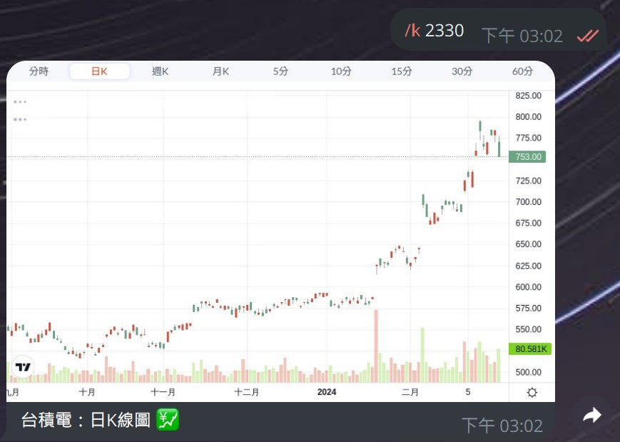
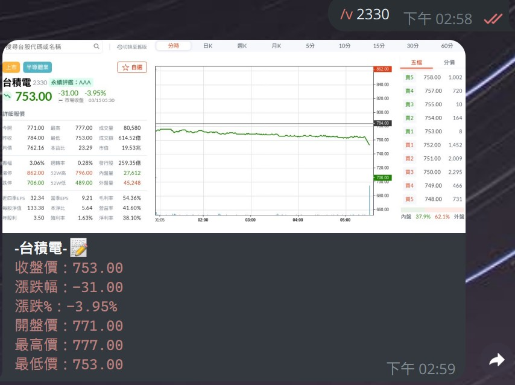
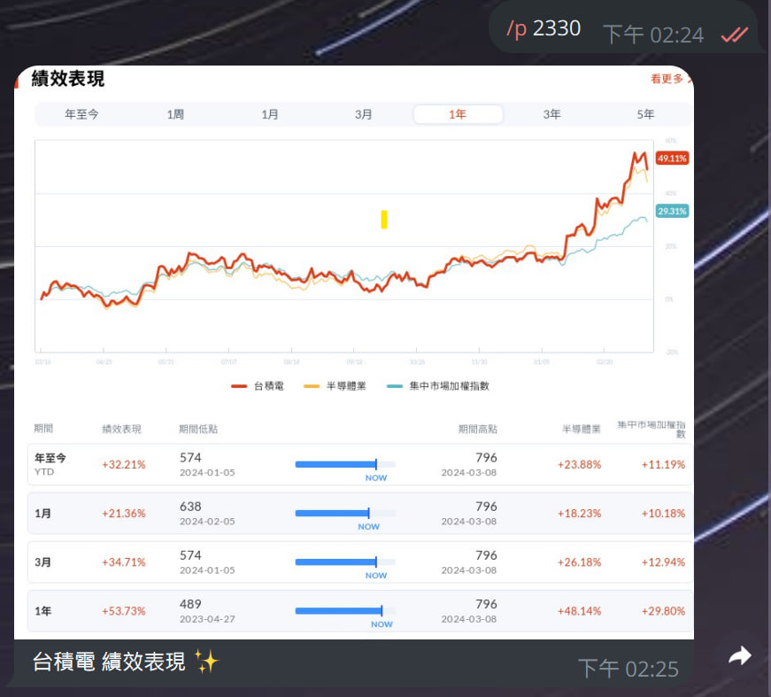
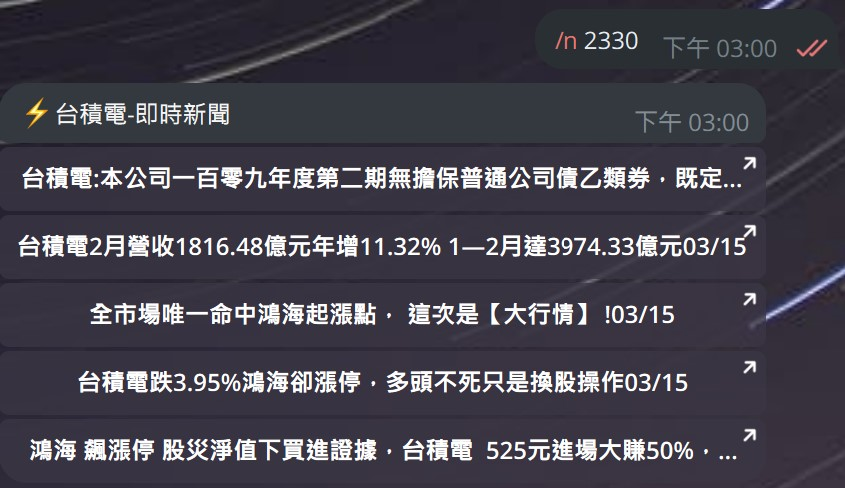

telegram 台灣股市查詢

<div style="text-align: center;">
    
</div>

## 使用教學

示範機器人(可以直接使用)

```
https://t.me/oli_billion_bot
```

&nbsp;

使用方法：

👉 直接執行
將appsettings.json.example 做 rename 為 appsettings.json
BotToken換成自己的telegram bot Key後執行檔案即可使用


👉 使用Docker執行

將程式pull下來後打包成Docker使用

```
docker run -d --name telegram-bot-stock tbdavid2019/telegram-bot-stock:latest

```

&nbsp;

## 機器人指令 🗒

⭐️K線走勢圖
```cmd
/k 2330 d

--K線代碼--
h - 查詢時K線
d - 查詢日K線
w - 查詢週K線
m - 查詢月K線
5m - 查詢5分K線
10m - 查詢10分K線
15m - 查詢15分K線
30m - 查詢30分K線
60m - 查詢60分K線
```

&nbsp;

⭐️股價資訊
```cmd
/v 2330 
```

&nbsp;

⭐️績效資訊
```cmd
/p 2330 
```

&nbsp;

⭐️個股新聞
```cmd
/n 2330
```

&nbsp;


## 📄  專案介紹

### ✏️ 程式流程說明
```cmd


使用 C#.NET6 搭配 Telegram Bot套件製作
使用者傳送指令命令時觸發程式
利用 Playwright 爬蟲套件，依據使用者指令抓取指定內容並回傳資訊
```


本專案fork   https://github.com/mlouielu/twstock


